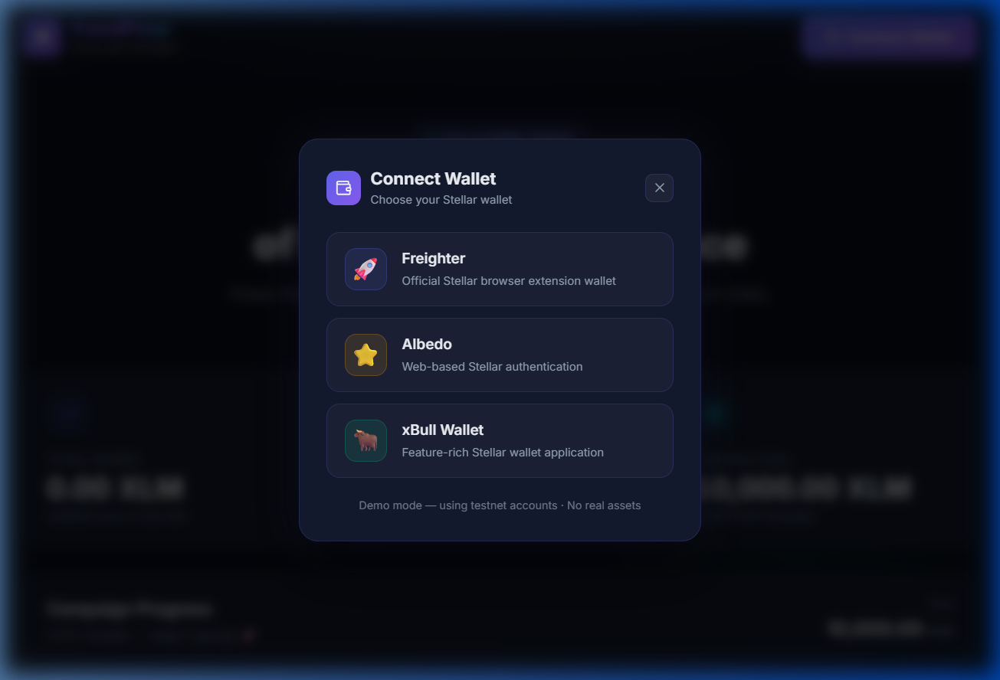

# 🚀 FundFlow — Real-time Crowdfunding on Stellar

A decentralized crowdfunding dApp built on the **Stellar Testnet** using **Soroban** smart contracts. Every donation is recorded on-chain, transparent, and immutable.

[](https://stellar.org)
[](https://soroban.stellar.org)
[](https://vitejs.dev)

---

## 📸 Live Demo

> **Live Demo:** _[Coming soon — deploy to Vercel/Netlify and paste URL here]_
> **Deployed Contract Address:** `CAYPRQFZ6MI5ADZEMMPPNLR4E6MYYUY6HQN2YJMH4XF6KAJE5SFTLADB`
> **Network:** Stellar Testnet (Soroban)

You can verify the deployed contract on [Stellar Expert](https://stellar.expert/explorer/testnet/contract/CAYPRQFZ6MI5ADZEMMPPNLR4E6MYYUY6HQN2YJMH4XF6KAJE5SFTLADB).

---

## 👛 Wallet Options Available

The dApp supports **3 Stellar wallets** via a polished selection modal:



| Wallet | Type | Description |
|--------|------|-------------|
| 🚀 **Freighter** | Browser Extension | Official Stellar wallet by SDF |
| ⭐ **Albedo** | Web-based | No install required |
| 🐂 **xBull Wallet** | App | Feature-rich Stellar wallet |

---

## 🏗️ Tech Stack

| Layer | Technology |
|-------|-----------|
| **Frontend** | React 19, Vite, CSS |
| **Wallet** | Custom multi-wallet modal (Freighter, Albedo, xBull) |
| **Blockchain SDK** | `@stellar/stellar-sdk` |
| **Smart Contract** | Rust + Soroban SDK |
| **Network** | Stellar Testnet + Soroban RPC |

---

## 🔒 Error Handling (3+ Error Types)

The application handles all critical failure scenarios with user-friendly messages:

| Error Code | Cause | User Message |
|------------|-------|-------------|
| `USER_REJECTED` | User cancelled in wallet | "You declined the transaction" |
| `INSUFFICIENT_BALANCE` | Not enough XLM | "Insufficient Balance" |
| `TRANSACTION_FAILED` | On-chain failure | "Transaction Failed — try again" |
| `CONTRACT_NOT_DEPLOYED` | Missing CONTRACT_ID | "Deploy the contract first" |
| `WALLET_NOT_FOUND` | No extension installed | "Install Freighter wallet" |

---

## 📡 Contract Interaction from Frontend

The frontend directly calls the deployed Soroban contract:

- **`get_campaign_info()`** — polled every 4 seconds for real-time stats
- **`donate(donor, amount)`** — called when user submits the donation form

```js
// src/hooks/useContract.js — polls every 4 seconds
const refresh = useCallback(async () => {
  const data = await fetchCampaignInfo(); // calls get_campaign_info()
  setCampaignData(data);
}, []);
```

---

## 📊 Transaction Status

Every donation shows real-time status:

- **⏳ Pending** — Waiting for wallet signature and blockchain confirmation
- **✅ Confirmed** — Transaction hash with link to Stellar Explorer
- **❌ Error** — Specific error message with recovery instructions

---

## 🏛️ Architecture

```
┌─────────────────────────────────┐
│         React Frontend           │
│  useWallet ──► WalletModal      │
│  useContract ──► 4s polling     │
│  DonateForm ──► tx status UI    │
└──────────────┬──────────────────┘
               │ Soroban RPC
┌──────────────▼──────────────────┐
│      Soroban Smart Contract      │
│  initialize(goal)                │
│  donate(donor, amount) ──► event│
│  get_campaign_info() ──► struct  │
└─────────────────────────────────┘
```

---

## 📦 Prerequisites

- **Node.js** ≥ 18 and **npm** ≥ 9
- **Rust** + `wasm32-unknown-unknown` target (`rustup target add wasm32-unknown-unknown`)
- **Stellar CLI** (`cargo install --locked stellar-cli --features opt`)
- A **Freighter Wallet** extension (or Albedo/xBull) with testnet XLM

---

## 🛠️ Setup & Installation

### 1. Clone and install frontend dependencies

```bash
git clone <repository-url>
cd "stellar level 02"
npm install
```

### 2. Configure environment

```bash
cp .env.example .env
# The contract is already deployed. Your .env should contain:
# VITE_CONTRACT_ID=CAYPRQFZ6MI5ADZEMMPPNLR4E6MYYUY6HQN2YJMH4XF6KAJE5SFTLADB
```

### 3. Run the development server

```bash
npm run dev
```

Open [http://localhost:5173](http://localhost:5173) in your browser.

---

## 🦀 Smart Contract Deployment (for reference)

The contract is already deployed. To re-deploy:

### Step 1: Generate or fund a Stellar identity

```bash
stellar keys generate --global my-account --network testnet
stellar keys fund my-account --network testnet
```

### Step 2: Build the contract

```bash
cd contract
stellar contract build
```

### Step 3: Deploy to Testnet

```bash
stellar contract deploy \
  --wasm target/wasm32-unknown-unknown/release/fundflow.wasm \
  --source my-account \
  --network testnet
```

### Step 4: Initialize the contract

```bash
stellar contract invoke \
  --id <CONTRACT_ID> \
  --source my-account \
  --network testnet \
  -- initialize \
  --goal 100000000000
```

### Step 5: Update your .env

```bash
VITE_CONTRACT_ID=<CONTRACT_ID>
```

---

## 🧪 Running Contract Tests

```bash
cd contract
cargo test
```

---

## 📂 Project Structure

```
stellar level 02/
├── contract/
│   ├── Cargo.toml
│   └── src/
│       └── lib.rs          # Soroban smart contract (Rust)
├── src/
│   ├── components/
│   │   ├── Header.jsx      # Sticky header with wallet connect
│   │   ├── WalletModal.jsx # Multi-wallet selection modal
│   │   ├── StatCard.jsx    # Metric cards
│   │   ├── ProgressBar.jsx # Animated funding progress
│   │   ├── ActivityFeed.jsx# Live donation feed
│   │   └── DonateForm.jsx  # Donation form + tx status
│   ├── hooks/
│   │   ├── useContract.js  # Contract polling hook
│   │   └── useWallet.js    # Multi-wallet hook
│   ├── utils/
│   │   └── stellar.js      # Soroban SDK helpers
│   ├── config.js           # Network & contract config
│   ├── App.jsx
│   └── index.css
├── public/
│   └── wallet-modal-screenshot.png
├── .env.example
├── index.html
├── vite.config.js
└── README.md
```

---

## 🌊 Data Flow

```
User clicks "Donate"
       │
       ▼
DonateForm.jsx → submitDonation(donor, amount, signFn)
       │
       ▼
stellar.js: Build Soroban transaction (TransactionBuilder)
       │
       ▼
Simulate tx on Soroban RPC (get auth footprint)
       │
       ▼
WalletModal / Freighter: signTransaction(xdr) → signed XDR
       │
       ▼
server.sendTransaction(signedTx) → { hash }
       │
       ▼
Poll server.getTransaction(hash) until CONFIRMED
       │
       ▼
useContract.refresh() → update Dashboard in real-time
```

---

## 📄 License

MIT
